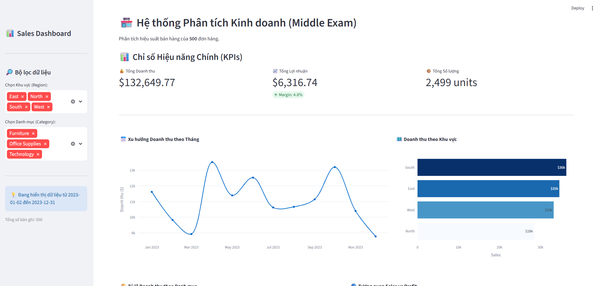

# Sales Analytics Dashboard

Dự án này trình bày một quy trình phân tích dữ liệu bán hàng hoàn chỉnh, đi từ bước làm sạch dữ liệu thô cho đến việc xây dựng một dashboard tương tác để trực quan hóa kết quả. Toàn bộ quy trình được thực hiện trên tập dữ liệu Superstore Sales, ghi lại các đơn hàng bán lẻ gồm thông tin doanh thu, lợi nhuận, danh mục sản phẩm và khu vực địa lý.



## Mô tả

Mục tiêu chính của dự án là tổ chức một pipeline phân tích dữ liệu có cấu trúc rõ ràng. Dữ liệu gốc được khảo sát và làm sạch trước, sau đó trải qua các bước phân tích thống kê và trực quan hóa chuyên sâu. Kết quả cuối cùng được trình bày qua một ứng dụng Streamlit cho phép người dùng lọc dữ liệu theo Region và Category, đồng thời quan sát các chỉ số KPI cùng nhiều góc độ phân tích khác nhau.

Dashboard cung cấp ba chỉ số tổng hợp gồm tổng doanh thu, tổng lợi nhuận kèm theo profit margin và tổng số lượng sản phẩm đã bán. Phần biểu đồ bao gồm xu hướng doanh thu theo tháng, so sánh doanh thu giữa các khu vực, tỷ lệ đóng góp của từng danh mục sản phẩm, tương quan giữa Sales với Profit, và phân tích doanh thu theo CustomerType cùng xu hướng biến động của từng nhóm khách hàng theo thời gian.

## Cấu trúc thư mục

```
data-cleaning-to-dashboard/
├── notebooks/
│   ├── data_exploration.ipynb           # Khảo sát cấu trúc và phân phối dữ liệu
│   ├── data_cleaning.ipynb              # Xử lý giá trị thiếu, chuẩn hóa kiểu dữ liệu
│   ├── data_visualization.ipynb         # Trực quan hóa chuyên sâu bằng matplotlib/seaborn
│   ├── insights_business_analysis.ipynb # Phân tích chỉ số kinh doanh
│   ├── advanced.ipynb                   # Phân tích nâng cao: dashboard và CustomerType
│   ├── sales_data5.csv                  # Dữ liệu gốc
│   └── orders_cleaned.csv               # Dữ liệu sau khi làm sạch
├── assests/
│   └── image.png
├── dashboard_exam.py                 # Ứng dụng Streamlit
├── pyproject.toml
└── uv.lock
```

## Notebooks

Quy trình phân tích được chia thành năm notebook theo thứ tự thực thi.

[1. Data Exploration](notebooks/data_exploration.ipynb) — Khảo sát tổng quan tập dữ liệu: kiểm tra kiểu dữ liệu, phân phối giá trị, thống kê mô tả và phát hiện các vùng dữ liệu bất thường cần xử lý.

[2. Data Cleaning](notebooks/data_cleaning.ipynb) — Xử lý giá trị thiếu, loại bỏ bản ghi trùng lặp, chuẩn hóa định dạng ngày tháng và đảm bảo tính nhất quán của các cột phân loại. Kết quả được lưu ra `orders_cleaned.csv`.

[3. Data Visualization](notebooks/data_visualization.ipynb) — Trực quan hóa dữ liệu đã làm sạch thông qua các biểu đồ phân tích theo thời gian, theo khu vực và theo danh mục sản phẩm.

[4. Insights and Business Analysis](notebooks/insights_business_analysis.ipynb) — Rút ra các nhận xét kinh doanh từ kết quả phân tích, tập trung vào profit margin theo segment, sản phẩm có biên lợi nhuận âm và xu hướng theo mùa.

[5. Advanced](notebooks/advanced.ipynb) — Tài liệu hóa phần phân tích nâng cao, bao gồm mô tả dashboard đã xây dựng và phân tích chuyên sâu về doanh thu theo CustomerType. Notebook rút ra nhận xét rằng nhóm Consumer đóng góp doanh thu cao hơn Corporate và ổn định hơn theo thời gian, trong khi Corporate có xu hướng biến động mạnh vào cuối năm.

## Setup và chạy ứng dụng

Dự án sử dụng [uv](https://github.com/astral-sh/uv) để quản lý dependencies. Yêu cầu Python 3.13 trở lên.

Bước đầu tiên là cài đặt toàn bộ dependencies đã được khai báo sẵn trong `pyproject.toml`.

```bash
uv sync
```

Sau khi cài đặt hoàn tất, khởi động Streamlit dashboard bằng lệnh sau. App sẽ chạy trên port 8502 để tránh xung đột với các dịch vụ khác.

```bash
uv run streamlit run dashboard_exam.py --server.port 8502
```

Truy cập dashboard tại `http://localhost:8502`.
